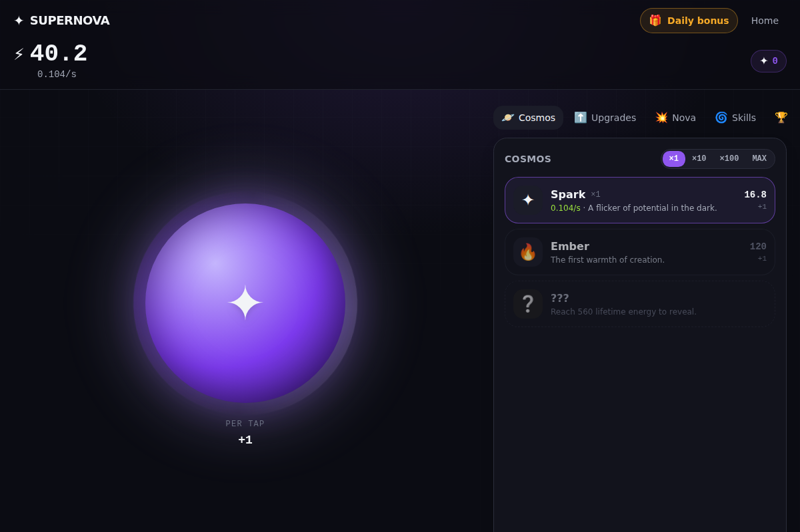

<div align="center">

# ✦ SUPERNOVA

### Tap a spark. Build a universe. Never stop.

A hypnotic, deeply juicy **idle / incremental game** built to be played — and to make
money — with zero backend and zero running cost.



</div>

---

## What it is

You start as a single spark in an empty void. Tap it. Spend the energy on
generators — embers, protostars, stars, nebulae, black holes, whole galaxies —
each producing forever. Catch golden **Solar Flares** for random surges. When
you're strong enough, **go Supernova**: collapse everything into Stardust, spend
it on a permanent skill tree, and begin again — richer every time.

It's the loop that never lets go: **Tap → Ignite → Surge → Collapse → Repeat.**

## Why it's built to be addictive (honestly)

Every mechanic is a well-understood engagement loop from great games — used to
delight, never to exploit. No real-money gambling, no predatory timers, no dark
patterns.

- **Instant juice** — particles, floating numbers, rising combo tones, screen glow on every tap.
- **Variable rewards** — Solar Flares appear at unpredictable moments for surges, frenzies, tap-storms, jackpots.
- **Numbers go up** — exponential generators & upgrades, formatted K → M → B → T → … → scientific.
- **Constant unlocks** — a steady drip of new generators, upgrades, and tiers.
- **Milestones** — 25+ achievements, each a small permanent boost and a little win.
- **Return hooks** — offline production + a "welcome back" payout.
- **Prestige** — the Supernova skill tree, the deep long-term retention loop.
- **Streaks** — an escalating daily bonus.

## Why it makes money

- **Free, instant, no signup** → low friction, great for organic + viral traffic.
- **SEO landing page** for acquisition; **shareable** by design.
- **Fully client-side** → free hosting (Vercel/Netlify/Pages), infinite scale, **~100% margin**.
- **Rewarded ads** (opt-in "double it" / boosts) + rare **interstitial** on prestige.
- **Supporter Pack** — one-time purchase: removes ads, exclusive skins, +10% forever.

See **[docs/MONETIZATION.md](docs/MONETIZATION.md)** for the full playbook (wiring
AdSense + a Stripe Payment Link takes ~15 minutes).

## Quick start

```bash
npm install
npm run dev          # http://localhost:3000  (landing) · /play (game)
```

No environment variables are required — the game runs entirely in the browser and
saves to `localStorage`.

```bash
npm run build        # production build (all static)
npm start            # serve the production build
npm test             # run the engine unit tests (Vitest)
npm run typecheck    # strict TypeScript check
```

Tune the economy with the built-in simulator:

```bash
npx tsx scripts/sim.ts 1     # idle-ish pacing
npx tsx scripts/sim.ts 4     # active pacing
```

## Tech

- **Next.js (App Router) + TypeScript** — landing + game + PWA in one free deploy.
- **Tailwind CSS** — bespoke dark, music/cosmos design system.
- **Pure engine** (`src/lib/game/engine.ts`) — all math, no React, unit-tested.
- **RAF store loop** (`src/lib/game/store.ts`) — 60fps feel, throttled React commits.
- **WebAudio synth** — procedural sound, no asset files.
- **Zod** — resilient, versioned save with export/import.

## Documentation

| Doc | What's inside |
| --- | --- |
| [docs/MASTER_PROMPT.md](docs/MASTER_PROMPT.md) | The autonomous build brief |
| [docs/PROJECT_PLAN.md](docs/PROJECT_PLAN.md) | Roadmap & status |
| [docs/ARCHITECTURE.md](docs/ARCHITECTURE.md) | How the code fits together |
| [docs/GAME-DESIGN.md](docs/GAME-DESIGN.md) | The systems & why they hook |
| [docs/MONETIZATION.md](docs/MONETIZATION.md) | Turning players into revenue |
| [docs/DEPLOY.md](docs/DEPLOY.md) | Ship it free in minutes |

## License

See [LICENSE](LICENSE).
